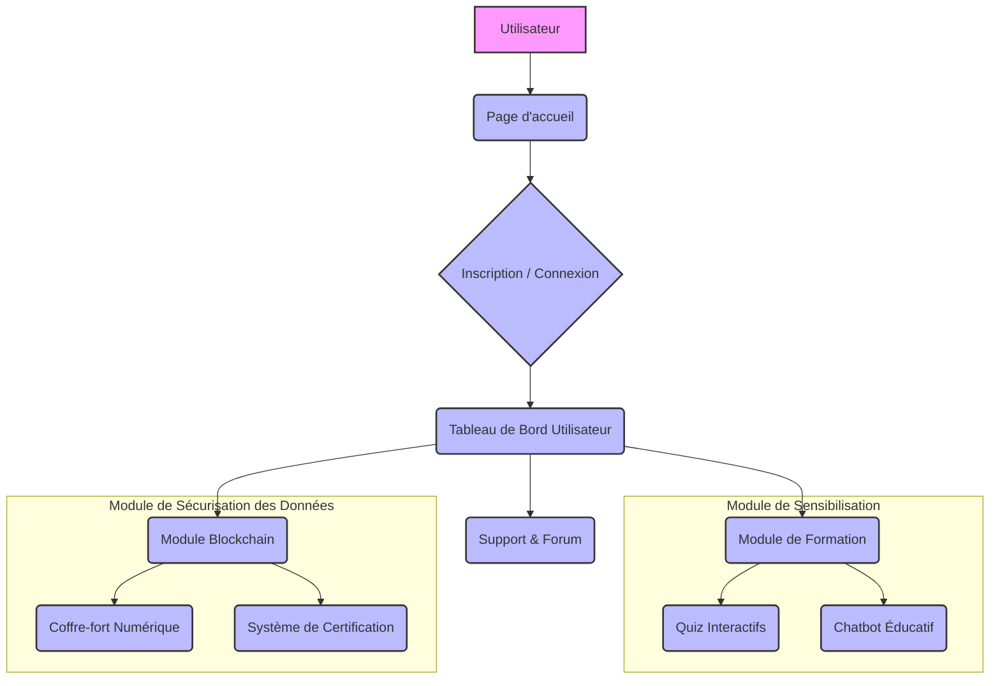
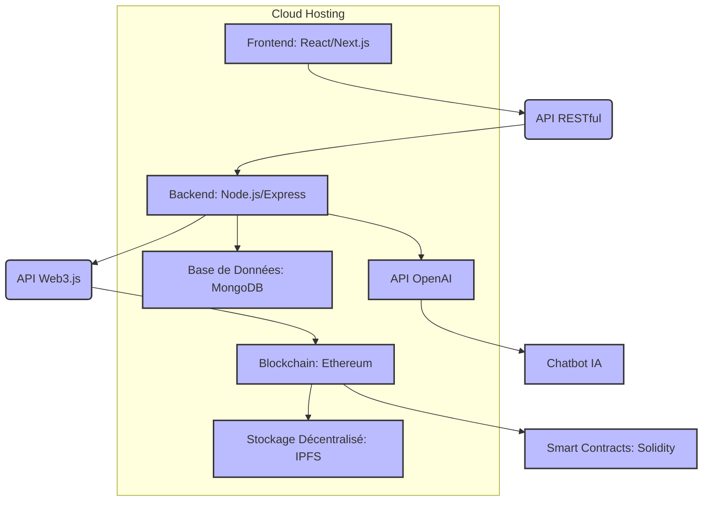

## 1. Introduction : Naviguer dans le Paysage Numérique Sécurisé

Dans un monde de plus en plus interconnecté, la cybersécurité est devenue une préoccupation majeure, tant pour les individus que pour les organisations. Les menaces numériques évoluent constamment, rendant indispensable une sensibilisation accrue et l'adoption de pratiques de protection robustes. C'est dans ce contexte que s'inscrit le projet **Cyber Aware**, une plateforme pédagogique innovante conçue pour démystifier les enjeux de la cybersécurité et offrir des outils concrets pour la sécurisation des données.

Ce rapport a pour objectif de présenter en détail la conception, le développement et les perspectives d'évolution de **Cyber Aware**. Il s'articule autour des sections suivantes :

*   **Résumé du Projet :** Une vue d'ensemble concise du contexte, des objectifs et du public cible de la plateforme.
*   **Cahier des Charges :** Les spécifications fonctionnelles et techniques qui ont guidé le développement.
*   **Architecture Fonctionnelle et Technique :** La structure interne de la solution, illustrée par des schémas clairs.
*   **Veille Technologique & Justification des Choix Techniques :** L'analyse des technologies étudiées et la justification des décisions prises.
*   **Conception UX/UI :** La présentation des maquettes et les principes de design qui ont façonné l'expérience utilisateur.
*   **Méthodologie de Travail :** L'approche agile (Scrum) adoptée par l'équipe pour gérer le projet.
*   **Développement :** Les fonctionnalités implémentées et les défis techniques rencontrés.
*   **Tests & Retours :** L'assurance qualité et les ajustements réalisés suite aux tests.
*   **Bilan et Perspectives :** Une rétrospective du projet et les pistes d'amélioration futures.

À travers ce document, nous souhaitons démontrer la pertinence de notre solution face aux défis actuels de la cybersécurité, la rigueur de notre démarche de développement et notre capacité à innover pour un cyberespace plus sûr.

### Contexte et Problématique : L'Urgence d'une Cybersécurité Accrue

Dans un paysage numérique en constante évolution, où la connectivité est devenue le pilier de nos sociétés, les cyberattaques représentent une menace croissante et omniprésente. Elles ne se limitent plus aux grandes entreprises ou aux gouvernements, mais touchent désormais aussi bien les individus que les organisations de toutes tailles. Le manque de sensibilisation et de connaissances en matière de cybersécurité expose un large public à des risques significatifs, tels que le phishing, les ransomwares, le vol de données personnelles et les attaques d'ingénierie sociale. Ces menaces peuvent entraîner des pertes financières substantielles, des atteintes à la réputation, des interruptions d'activité et des violations profondes de la vie privée. Parallèlement, la sécurisation et l'intégrité des données sensibles constituent un défi majeur, exacerbé par la fréquence alarmante des fuites de données et la nécessité impérieuse de garantir l'authenticité et l'immuabilité des documents numériques. Il est donc impératif de développer des solutions innovantes qui non seulement éduquent et sensibilisent le public aux dangers insidieux du cyberespace, mais offrent également des mécanismes robustes et fiables pour la protection et la vérification des informations critiques. Le projet **Cyber Aware** émerge de cette nécessité pressante, proposant une réponse structurée et technologique à ces enjeux cruciaux.

### Objectifs du Projet : Bâtir une Résilience Numérique Durable

Le projet **Cyber Aware** vise à répondre à cette double problématique en poursuivant deux objectifs stratégiques principaux, conçus pour bâtir une résilience numérique durable :

1.  **Sensibilisation et Éducation Ciblée :** Créer une plateforme interactive et engageante qui sensibilise activement les utilisateurs aux différentes formes de cyberattaques. Cette plateforme utilisera des méthodes pédagogiques variées et éprouvées, incluant des simulations réalistes, des quiz interactifs et un chatbot éducatif alimenté par l'intelligence artificielle, pour renforcer la compréhension des menaces, développer des réflexes de défense et promouvoir des pratiques de sécurité numérique responsables et proactives.

2.  **Sécurisation des Données par la Blockchain :** Mettre en œuvre une solution de stockage et de vérification des données sensibles basée sur la technologie blockchain. Ce module offrira un coffre-fort numérique sécurisé et un système de certification garantissant l'authenticité, l'intégrité et l'immuabilité des documents, répondant ainsi aux besoins croissants de protection des informations critiques dans un environnement de confiance distribuée.

### Public Cible : Une Solution pour Tous les Acteurs du Numérique

La plateforme **Cyber Aware** s'adresse à un public diversifié et étendu, reconnaissant que la cybersécurité est l'affaire de tous :

*   **Étudiants et Professionnels :** Toute personne souhaitant améliorer ses connaissances en cybersécurité, se tenir informée des dernières menaces et se prémunir efficacement contre les attaques numériques, qu'il s'agisse de novices ou d'experts cherchant à approfondir leurs compétences.
*   **Entreprises et Institutions Éducatives :** Organisations soucieuses de former leurs employés ou étudiants aux bonnes pratiques de cybersécurité, de renforcer leur posture de défense et de sécuriser leurs documents internes et externes via des technologies de pointe.
*   **Grand Public :** Individus désireux de comprendre les risques inhérents au cyberespace et d'adopter des comportements plus sûrs et plus conscients lors de leurs interactions en ligne.

Le projet **Cyber Aware** se positionne ainsi comme un outil essentiel et innovant pour renforcer la résilience numérique de ses utilisateurs, en leur fournissant les connaissances fondamentales et les outils technologiques nécessaires pour naviguer en toute sécurité et avec confiance dans le monde digital de demain.


## 3. Cahier des Charges

Le cahier des charges de notre projet, **Cyber Aware**, détaille les fondations, les objectifs, les fonctionnalités et les contraintes techniques qui ont guidé son développement. Il sert de référence principale pour l'ensemble de l'équipe et assure une compréhension commune des attentes.

### 3.1. Présentation du Projet : Une Réponse Stratégique aux Enjeux de la Cybersécurité

Le projet **Cyber Aware** est une plateforme interactive novatrice, méticuleusement conçue pour sensibiliser les utilisateurs aux cyberattaques et offrir une solution robuste de sécurisation des données via la technologie blockchain. Le choix de ce sujet éminemment actuel découle d'une observation critique et alarmante : malgré la prévalence exponentielle des menaces numériques, une lacune significative et persistante demeure dans la sensibilisation et l'éducation du grand public, des étudiants et des professionnels. Les incidents de phishing, les attaques de rançongiciels et les vols massifs de données sont devenus monnaie courante, soulignant un besoin urgent et impérieux de renforcer les défenses individuelles et organisationnelles. De surcroît, la falsification et la fuite de documents sensibles posent des défis majeurs en termes de confiance numérique et d'intégrité des informations. Notre projet vise à combler ces lacunes criantes en proposant une approche pédagogique innovante, immersive et pragmatique, couplée à une solution technique de pointe, exploitant pleinement le potentiel disruptif de la blockchain pour la sécurité et l'immuabilité des informations. **Cyber Aware** se positionne ainsi comme un acteur clé dans la construction d'un cyberespace plus sûr et plus résilient.

### 3.2. Objectifs : Une Feuille de Route pour l'Innovation et la Sécurité

Les objectifs spécifiques du projet **Cyber Aware** sont les suivants, et constituent une feuille de route claire pour notre démarche d'innovation et de sécurité :

*   **Concevoir une plateforme web interactive et intuitive :** La plateforme doit être accessible à un large éventail d'utilisateurs, quel que soit leur niveau de compétence technique, et offrir une expérience utilisateur (UX) intuitive, engageante et fluide. L'accent sera mis sur la simplicité de navigation et la clarté des informations.
*   **Intégrer des modules pédagogiques dynamiques et immersifs :** Développer des modules interactifs couvrant les principales cyberattaques (phishing, ransomware, ingénierie sociale, etc.) pour éduquer les utilisateurs de manière pratique, immersive et mémorable. Ces modules incluront des simulations, des quiz et des contenus multimédias.
*   **Fournir un tableau de bord utilisateur personnalisé et évolutif :** Permettre aux utilisateurs de suivre leur progression, leurs scores aux quiz et leurs performances dans les simulations, afin de mesurer leur amélioration continue et d'identifier les domaines à renforcer. Ce tableau de bord sera le reflet de leur parcours d'apprentissage.
*   **Garantir la confidentialité, l'intégrité et la disponibilité des données (CID) :** Assurer la sécurité des informations échangées sur la plateforme et stockées dans le coffre-fort numérique, en utilisant des mécanismes de cryptage robustes, des protocoles d'authentification avancés et des mesures de résilience contre les attaques.
*   **Mettre en place une solution de stockage sécurisé et immuable basée sur la Blockchain :** Développer un coffre-fort numérique exploitant les propriétés intrinsèques d'immuabilité, de transparence et de décentralisation de la blockchain pour le stockage et la certification de documents sensibles. Cela inclura la gestion des preuves d'intégrité via des empreintes cryptographiques.

### 3.3. Fonctionnalités Prioritaires : Une Approche Modulaire et Stratégique

Le projet **Cyber Aware** est structuré autour de deux modules principaux, chacun intégrant des fonctionnalités spécifiques, classées selon la matrice MoSCoW (Must Have, Should Have, Could Have, Won't Have) pour une priorisation stratégique du développement, garantissant ainsi la livraison d'un produit à forte valeur ajoutée.

#### Module 1 : Sensibilisation aux Cyberattaques

*   **Fonctionnalités Essentielles (Must Have) :**
    *   **Simulateur de Phishing Avancé :** Conception et implémentation d'un simulateur permettant l'envoi d'e-mails factices personnalisés aux utilisateurs. L'objectif est de tester leur vigilance, leur capacité à identifier les tentatives de phishing et à réagir de manière appropriée. Un retour immédiat et pédagogique sera fourni sur les erreurs commises et les bonnes pratiques à adopter, incluant des analyses comportementales.
    *   **Chatbot Éducatif Intelligent :** Un assistant virtuel conversationnel, alimenté par une intelligence artificielle de pointe (basée sur l'API OpenAI GPT), capable de répondre de manière précise et contextuelle aux questions des utilisateurs sur les cybermenaces, de fournir des conseils de sécurité personnalisés et d'expliquer des concepts complexes de manière simple, interactive et engageante.
    *   **Quiz et Scénarios Interactifs Immersifs :** Des évaluations ludiques et des mises en situation réalistes, conçues pour permettre aux utilisateurs de tester leurs connaissances, de pratiquer la prise de décision face à des menaces simulées et de renforcer leurs compétences pratiques en cybersécurité.

*   **Fonctionnalités Secondaires (Should Have) :**
    *   **Tableau de Bord Utilisateur Intuitif :** Une interface personnalisée et ergonomique affichant la progression de l'utilisateur, les scores obtenus aux quiz et simulations, les modules complétés, et des recommandations personnalisées pour l'amélioration continue de leurs compétences en cybersécurité.

*   **Fonctionnalités Optionnelles (Could Have) :**
    *   **Certificats de Participation Numériques :** Attestation de complétion des modules ou de réussite à des parcours spécifiques, valorisant l'engagement de l'utilisateur et reconnaissant ses acquis en matière de cybersécurité.

#### Module 2 : Sécurisation des Données avec la Blockchain

*   **Fonctionnalités Essentielles (Must Have) :**
    *   **Coffre-fort Numérique Sécurisé :** Un espace hautement sécurisé pour le stockage de fichiers sensibles (mots de passe, documents officiels, etc.), intégrant des mécanismes de cryptage robustes, une gestion fine des accès et une architecture résiliente.
    *   **Système de Certification Blockchain :** Utilisation de la blockchain (Ethereum) pour générer des preuves d'authenticité et d'intégrité des fichiers. Cela permet de vérifier de manière immuable qu'un document n'a pas été altéré depuis son enregistrement initial sur la blockchain, offrant une garantie de confiance inégalée.
    *   **Accès Sécurisé et Authentification Renforcée :** Implémentation d'une authentification multi-facteurs (MFA) robuste pour renforcer la sécurité de l'accès au coffre-fort numérique, protégeant ainsi les données les plus sensibles.
    *   **Enregistrement et Traçabilité Immuable des Données :** Les opérations clés (ajout, modification, vérification de documents) sont enregistrées de manière transparente et immuable sur la blockchain, offrant une traçabilité complète et infalsifiable de l'historique des documents.

### 3.4. Contraintes Techniques : Les Piliers de notre Architecture

Le développement de **Cyber Aware** est soumis à un ensemble de contraintes techniques rigoureuses qui ont profondément influencé nos choix technologiques et la conception de notre architecture :

*   **Langages de Programmation :** JavaScript est le langage principal, avec React.js pour le front-end et Node.js (Express.js) pour le back-end. Solidity est utilisé pour les smart contracts sur la blockchain Ethereum, garantissant une compatibilité et une interopérabilité optimales.
*   **Frameworks :** Next.js est envisagé pour le front-end afin de bénéficier de ses capacités de rendu côté serveur (SSR) et d'optimisation SEO, essentielles pour la visibilité de la plateforme. Express.js est le framework back-end privilégié pour sa flexibilité, sa robustesse et sa capacité à construire des API RESTful performantes.
*   **Base de Données :** MongoDB est la base de données choisie pour sa flexibilité NoSQL, parfaitement adaptée à la gestion de données non structurées et semi-structurées, telles que les profils utilisateurs, les résultats des quiz et les logs d'activité.
*   **API :** Une API RESTful est mise en place pour la communication fluide et sécurisée entre le front-end et le back-end. Web3.js est utilisé pour l'intégration et l'interaction directe avec la blockchain Ethereum depuis le back-end, assurant une connectivité fiable.
*   **Hébergement :** La plateforme sera déployée sur un serveur cloud (AWS ou Heroku) pour garantir une scalabilité horizontale, une haute disponibilité et des performances optimales. L'utilisation systématique de HTTPS est obligatoire pour sécuriser toutes les communications et protéger l'intégrité des données en transit.
*   **Sécurité :** Au-delà de l'authentification multi-facteurs, la sécurité est renforcée par l'utilisation de JSON Web Tokens (JWT) pour une gestion sécurisée des sessions utilisateurs et le cryptage robuste des données sensibles, tant au repos qu'en transit.
*   **Stockage des Fichiers Blockchain :** IPFS (InterPlanetary File System) est utilisé pour le stockage décentralisé et résilient des fichiers sensibles. Seules les empreintes cryptographiques (hashes) de ces fichiers sont ensuite enregistrées sur la blockchain, garantissant ainsi leur intégrité, leur authenticité et leur immuabilité sans surcharger la chaîne.

Ces choix techniques, fruit d'une veille technologique rigoureuse et d'une analyse approfondie, sont les piliers de notre architecture et sont détaillés et justifiés dans les sections suivantes, notamment dans la veille technologique et l'architecture fonctionnelle et technique.


## 4. Architecture Fonctionnelle et Technique : Les Fondations d'une Plateforme Robuste

La conception de l'architecture de **Cyber Aware** a été pensée pour garantir la modularité, la scalabilité, la sécurité et la performance de la plateforme. Elle se divise en deux volets principaux : l'architecture fonctionnelle, qui décrit les interactions utilisateur et les flux d'informations, et l'architecture technique, qui détaille les composants logiciels et matériels sous-jacents, assurant ainsi une compréhension holistique du système.

### 4.1. Architecture Fonctionnelle : Optimisation de l'Expérience Utilisateur et des Flux d'Information

L'architecture fonctionnelle de **Cyber Aware** est méticuleusement conçue pour optimiser l'expérience utilisateur et faciliter l'accès intuitif aux différentes fonctionnalités. Elle est organisée autour des modules clés suivants, chacun contribuant à un parcours utilisateur fluide et engageant :



*   **Page d'accueil :** Véritable vitrine de la plateforme, la page d'accueil constitue le point d'entrée principal pour tout nouvel utilisateur. Elle a été conçue pour offrir une présentation concise mais percutante du projet, de ses objectifs fondamentaux et des bénéfices tangibles qu'elle apporte à l'utilisateur. Elle intègre des appels à l'action (CTA) clairs et stratégiquement placés pour faciliter l'inscription ou la connexion, ainsi qu'une section FAQ (Foire Aux Questions) pour répondre de manière proactive aux interrogations les plus fréquentes des visiteurs, optimisant ainsi l'engagement initial.
*   **Inscription / Connexion :** Ce module, conçu avec une attention particulière à la sécurité, permet aux nouveaux utilisateurs de créer un compte de manière fluide et aux utilisateurs existants de se connecter en toute confiance. Des options d'authentification simplifiées (ex: via des services tiers comme Google ou Microsoft) peuvent être envisagées pour améliorer l'expérience utilisateur, tout en garantissant une sécurité robuste des données d'identification et en respectant les normes de confidentialité.
*   **Module de Formation :** Véritable cœur pédagogique de la plateforme, ce module regroupe l'ensemble des contenus de sensibilisation à la cybersécurité. Il est subdivisé en plusieurs sections thématiques (ex: Introduction à la cybersécurité, Types de cyberattaques, Phishing, Ransomware, Ingénierie sociale), chacune intégrant des contenus interactifs et variés tels que des textes explicatifs clairs, des vidéos didactiques, des quiz auto-évaluatifs et des simulations immersives, pour une approche d'apprentissage complète et engageante.
*   **Tableau de Bord Utilisateur :** Une fois connecté, l'utilisateur accède à son tableau de bord personnalisé, une interface dynamique offrant une vue d'ensemble claire et synthétique de sa progression. Ce tableau de bord affiche les scores obtenus aux quiz et simulations, les modules complétés, et propose des recommandations personnalisées pour les prochaines étapes de son parcours d'apprentissage, favorisant ainsi une démarche proactive et ciblée.
*   **Module Blockchain (Coffre-fort numérique et Certification) :** Ce module innovant permet aux utilisateurs de stocker des documents sensibles de manière hautement sécurisée et de vérifier leur authenticité et leur intégrité. Il intègre des fonctionnalités d'upload de fichiers, de cryptage avancé, d'enregistrement des empreintes numériques sur la blockchain et de vérification de l'intégrité des documents, offrant ainsi une garantie d'immuabilité et de confiance.
*   **Support & Forum (Optionnel) :** Un espace dédié à l'aide mutuelle et à l'échange de connaissances entre utilisateurs. Le forum permet de poser des questions, de partager des expériences, de discuter des sujets liés à la cybersécurité et de créer une communauté d'apprentissage dynamique, renforçant ainsi l'aspect collaboratif de la plateforme.

L'interaction entre ces modules est fluide, permettant à l'utilisateur de naviguer intuitivement entre les contenus de formation, de consulter sa progression et d'accéder aux fonctionnalités de sécurisation des données. Les maquettes UI/UX, détaillées dans la section 6, illustrent visuellement ces flux et interactions.

### 4.2. Architecture Technique : Une Approche Microservices pour la Robustesse et la Scalabilité

L'architecture technique de **Cyber Aware** est basée sur une approche microservices, favorisant un découplage optimal des composants, une scalabilité horizontale accrue et une résilience renforcée. Elle est principalement composée des éléments suivants, chacun jouant un rôle crucial dans le fonctionnement global de la plateforme :



*   **Frontend (React / Next.js) :**
    *   **Rôle :** Constitue la couche de présentation de la plateforme, responsable de l'interface utilisateur (UI) et de l'expérience visuelle (UX). Il assure l'interactivité et la réactivité de l'application, en interagissant de manière asynchrone avec le back-end via des appels API RESTful.
    *   **Technologies :** **React.js** est utilisé pour la construction modulaire des composants UI, favorisant la réutilisabilité et la maintenabilité du code. **Next.js** est intégré pour ses capacités de rendu côté serveur (SSR) et de génération de sites statiques (SSG), ce qui améliore significativement les performances initiales, le référencement (SEO) et la rapidité de chargement des pages, offrant ainsi une expérience utilisateur optimale.

*   **Backend (Node.js / Express) :**
    *   **Rôle :** Sert de cerveau à l'application, gérant la logique métier complexe, l'authentification sécurisée des utilisateurs, le traitement et la persistance des données des modules de formation, ainsi que l'intégration cruciale avec la blockchain et l'API OpenAI.
    *   **Technologies :** **Node.js** est privilégié pour son environnement d'exécution JavaScript asynchrone et non bloquant, idéal pour construire des applications réseau scalables et performantes. **Express.js**, un framework web minimaliste et flexible pour Node.js, est utilisé pour la création d'API RESTful robustes et hautement disponibles, facilitant la communication fluide avec le frontend et les services externes.

*   **Base de Données (MongoDB) :**
    *   **Rôle :** Assure la persistance des données non sensibles de la plateforme, telles que les profils utilisateurs, les données de progression des modules de formation, les résultats des quiz et les logs d'activité. Elle est conçue pour gérer efficacement des volumes importants de données.
    *   **Technologie :** **MongoDB**, une base de données NoSQL orientée document, a été choisie pour sa flexibilité exceptionnelle dans la modélisation des données, sa capacité à gérer des données non structurées ou semi-structurées, et sa scalabilité horizontale. Son intégration native et fluide avec l'écosystème Node.js (via des ODM comme Mongoose) simplifie grandement le développement et la maintenance.

*   **API (RESTful et Web3.js) :**
    *   **API RESTful :** Constitue le canal de communication principal entre le frontend et le backend pour toutes les opérations standards (gestion des utilisateurs, récupération des contenus de formation, enregistrement des résultats, etc.). Elle est conçue pour être stateless, performante et sécurisée, garantissant une interaction fluide et fiable.
    *   **Web3.js :** Cette bibliothèque JavaScript est essentielle pour interagir avec la blockchain Ethereum. Elle est utilisée par le backend pour déployer et interagir avec les smart contracts, envoyer des transactions de manière sécurisée et récupérer des informations pertinentes depuis la blockchain, assurant ainsi la connectivité avec notre module de sécurisation des données.

*   **Blockchain (Ethereum / Smart Contracts Solidity / IPFS) :**
    *   **Rôle :** Fournit l'infrastructure décentralisée et immuable pour le coffre-fort numérique et le système de certification des documents. Elle garantit la transparence, la sécurité et la résistance à la censure des informations.
    *   **Technologies :** **Ethereum** est la plateforme blockchain choisie pour sa maturité, sa robustesse, sa communauté active et sa capacité à exécuter des smart contracts complexes. **Solidity** est le langage de programmation utilisé pour écrire les smart contracts qui définissent la logique du coffre-fort numérique (stockage des empreintes de fichiers, gestion des accès, certification). **IPFS (InterPlanetary File System)** est un protocole de stockage de fichiers décentralisé et distribué. Les fichiers sensibles eux-mêmes sont stockés sur IPFS, et seule leur empreinte cryptographique (hash) est enregistrée sur la blockchain, garantissant ainsi l'intégrité et la décentralisation du stockage sans surcharger la chaîne.

*   **Hébergement Cloud (AWS / Heroku) :**
    *   **Rôle :** Fournit l'infrastructure cloud nécessaire au déploiement, à l'exécution et à la gestion de l'application. Il assure la haute disponibilité, la scalabilité élastique et la sécurité de l'environnement de production, garantissant que la plateforme est accessible en permanence et peut s'adapter à la charge.
    *   **Technologies :** Des services comme **AWS EC2** (pour les instances de calcul), **S3** (pour le stockage d'objets), ou **Heroku** (plateforme PaaS simplifiée) sont envisagés pour le déploiement des applications frontend et backend. Une configuration **HTTPS** rigoureuse est mise en place pour sécuriser toutes les communications et protéger l'intégrité des données en transit, conformément aux meilleures pratiques de sécurité.

Cette architecture permet une séparation claire des préoccupations, facilitant le développement, la maintenance et l'évolution future de la plateforme. Elle est conçue pour être robuste et sécurisée, en intégrant des mécanismes d'authentification (JWT) et de cryptage des données à tous les niveaux.


## 5. Veille Technologique & Justification des Choix Techniques : Une Décision Éclairée

La sélection des technologies pour le projet **Cyber Aware** a été le fruit d'une veille technologique approfondie et d'une analyse comparative rigoureuse. L'objectif était d'identifier les outils et frameworks les plus adaptés pour garantir la performance, la scalabilité, la sécurité et la maintenabilité de la plateforme, tout en tenant compte des compétences de l'équipe et des contraintes de développement. Cette démarche proactive a permis de fonder nos choix sur des bases solides et de justifier chaque décision technique.

### 5.1. Technologies Étudiées et Comparaison des Alternatives : Un Panorama Détaillé

Notre veille s'est concentrée sur les principaux composants d'une application web moderne, avec une attention particulière pour les spécificités liées à la cybersécurité, à l'intégration blockchain et à l'intelligence artificielle. Nous avons analysé les forces et faiblesses de chaque alternative pour éclairer nos décisions.

#### 5.1.1. Frontend : Le Visage de l'Application

*   **React.js :** Bibliothèque JavaScript développée par Facebook, très populaire pour la création d'interfaces utilisateur interactives et performantes. Son approche basée sur les composants facilite la réutilisabilité du code et la gestion d'états complexes. Elle bénéficie d'une vaste communauté et d'un écosystème riche en bibliothèques et outils, garantissant un support étendu et une évolutivité.
*   **Vue.js :** Framework JavaScript progressif, réputé pour sa facilité d'apprentissage, sa légèreté et sa flexibilité. Il offre une courbe d'apprentissage plus douce que React ou Angular, tout en étant très performant pour les applications monopages (SPA) et les projets de taille moyenne. Son système de réactivité est particulièrement apprécié.
*   **Angular :** Framework complet développé par Google, offrant une solution structurée et opinionated pour les applications d'entreprise de grande envergure. Il intègre de nombreuses fonctionnalités par défaut (routage, gestion d'état, etc.) et impose une architecture stricte, ce qui peut être un avantage pour les équipes importantes mais le rend plus lourd et complexe à prendre en main pour les petits projets.

#### 5.1.2. Backend : Le Cerveau de la Logique Métier

*   **Node.js (avec Express.js) :** Environnement d'exécution JavaScript côté serveur, permettant de construire des applications réseau scalables et performantes grâce à son modèle d'E/S non bloquant. Express.js est un framework web minimaliste et flexible pour Node.js, idéal pour la création d'API RESTful robustes et hautement disponibles. L'avantage d'utiliser JavaScript sur toute la stack (frontend et backend) simplifie le développement et le partage de compétences.
*   **Python (avec Django/Flask) :** Python est un langage polyvalent, très apprécié pour le développement web (Django pour les applications complexes et monolithiques, Flask pour les microservices), l'analyse de données et l'intelligence artificielle. Il offre une grande lisibilité, une syntaxe claire et une vaste collection de bibliothèques, ce qui en fait un choix solide pour de nombreux types de projets.
*   **.NET (avec ASP.NET Core) :** Framework développé par Microsoft, robuste, performant et cross-platform, adapté aux applications d'entreprise critiques. Il supporte plusieurs langages (C#, F#, VB.NET) et offre une intégration profonde avec l'écosystème Microsoft Azure, ce qui est un atout pour les entreprises déjà investies dans cette technologie.

#### 5.1.3. Base de Données : La Persistance des Informations

*   **MongoDB :** Base de données NoSQL orientée document, offrant une grande flexibilité pour la modélisation des données. Elle est particulièrement adaptée aux applications qui nécessitent une scalabilité horizontale, une gestion de données non structurées ou semi-structurées, et une évolution rapide des schémas. Son intégration avec Node.js (via Mongoose) est très fluide et performante.
*   **PostgreSQL :** Système de gestion de base de données relationnelle (SGBDR) open-source, réputé pour sa robustesse, sa conformité aux standards SQL, sa fiabilité et ses fonctionnalités avancées (support JSON, géospatial, etc.). Il est idéal pour les applications nécessitant une forte intégrité des données, des relations complexes et des transactions ACID.
*   **Firebase (Firestore) :** Base de données NoSQL en temps réel de Google, souvent utilisée pour les applications mobiles et web nécessitant une synchronisation instantanée des données et une mise en place rapide. Elle est facile à démarrer mais peut devenir coûteuse à grande échelle et moins flexible pour des requêtes complexes ou des besoins de personnalisation avancée.

#### 5.1.4. Blockchain et Stockage Décentralisé : L'Ère de la Confiance Distribuée

*   **Ethereum :** Plateforme blockchain décentralisée permettant l'exécution de smart contracts. C'est la blockchain la plus mature, la plus utilisée et la plus documentée pour les applications décentralisées (dApps). Elle offre une grande flexibilité grâce à son langage de programmation Solidity et une communauté de développeurs très active.
*   **Hyperledger Fabric :** Plateforme blockchain de consortium, orientée entreprise, offrant des performances élevées, une confidentialité accrue grâce à des canaux privés et une architecture modulaire. Elle est plus adaptée aux cas d'usage B2B où la gouvernance, la permission et la traçabilité sont essentielles, mais moins ouverte que les blockchains publiques.
*   **IPFS (InterPlanetary File System) :** Protocole de stockage de fichiers décentralisé et distribué. Contrairement aux systèmes de stockage centralisés, IPFS permet de stocker des fichiers sur un réseau de nœuds, ce qui améliore la résilience, la disponibilité et la résistance à la censure. Il est idéal pour stocker des données dont l'empreinte est ensuite enregistrée sur une blockchain, assurant ainsi l'intégrité et la décentralisation du stockage.

#### 5.1.5. Intelligence Artificielle (Chatbot) : L'Interaction Intelligente

*   **OpenAI API (GPT) :** Offre un accès à des modèles de langage avancés comme GPT-3.5 et GPT-4, capables de générer du texte cohérent et pertinent, de répondre à des questions complexes et de simuler des conversations naturelles. C'est une solution puissante et flexible pour un chatbot éducatif, offrant une grande capacité de compréhension et de génération de langage.
*   **Dialogflow (Google) :** Plateforme de développement de chatbots basée sur le machine learning, offrant des outils pour la compréhension du langage naturel (NLU) et la gestion des dialogues. Plus orientée vers la création de chatbots conversationnels structurés et la gestion des intentions, elle est idéale pour les cas d'usage où les interactions sont prévisibles et basées sur des règles.

### 5.2. Choix Retenus et Justification : Les Fondements de notre Stack Technologique

Après cette veille, les choix technologiques suivants ont été arrêtés pour le projet **Cyber Aware** :

*   **Frontend : React.js avec Next.js**
    *   **Justification :** React.js offre une grande flexibilité et une communauté très active, garantissant un support et des ressources abondantes. L'ajout de Next.js permet de bénéficier du rendu côté serveur (SSR) et de la génération de sites statiques, ce qui est crucial pour l'optimisation des performances, le référencement (SEO) et une meilleure expérience utilisateur, notamment sur les pages de contenu éducatif. La modularité de React facilite le développement de composants UI complexes et réutilisables.

*   **Backend : Node.js avec Express.js**
    *   **Justification :** Node.js est un choix idéal pour les applications web modernes nécessitant une grande réactivité et une gestion efficace des E/S. Son modèle asynchrone et non bloquant est parfait pour gérer un grand nombre de requêtes simultanées, ce qui est pertinent pour une plateforme interactive. Express.js, étant un framework léger, offre la flexibilité nécessaire pour construire une API RESTful performante et sur mesure. L'utilisation d'un seul langage (JavaScript) pour le frontend et le backend simplifie également le développement et la maintenance.

*   **Base de Données : MongoDB**
    *   **Justification :** MongoDB a été choisi pour sa flexibilité et sa capacité à stocker des données non structurées, ce qui est avantageux pour les profils utilisateurs, les résultats de quiz et d'autres données évolutives. Sa scalabilité horizontale est un atout pour un projet potentiellement amené à accueillir un grand nombre d'utilisateurs. De plus, son intégration avec Node.js est très bien supportée.

*   **Blockchain : Ethereum avec Solidity et IPFS**
    *   **Justification :** Ethereum est la plateforme blockchain la plus mature et la plus documentée pour le développement de smart contracts. Sa robustesse et sa large adoption en font un choix fiable pour la sécurisation des données. Solidity est le langage standard pour les smart contracts sur Ethereum. L'intégration d'IPFS est essentielle pour le stockage décentralisé des fichiers sensibles, car stocker directement des fichiers volumineux sur la blockchain serait prohibitif en termes de coûts et de performances. IPFS permet de stocker les fichiers hors chaîne tout en garantifiant leur intégrité via les empreintes (hashes) enregistrées sur Ethereum.

*   **Intelligence Artificielle (Chatbot) : OpenAI API (GPT)**
    *   **Justification :** L'API OpenAI offre un accès à des modèles de langage de pointe, permettant de créer un chatbot éducatif très performant et capable de comprendre et de générer des réponses pertinentes sur des sujets complexes de cybersécurité. Sa capacité à simuler des conversations naturelles enrichira considérablement l'expérience d'apprentissage des utilisateurs.

*   **Hébergement : AWS / Heroku**
    *   **Justification :** Ces plateformes cloud offrent une infrastructure fiable, scalable et sécurisée, essentielle pour le déploiement d'une application web. Elles permettent une gestion simplifiée de l'infrastructure et une haute disponibilité, garantissant que la plateforme est accessible en permanence.

### 5.3. Sources de la Veille

Notre veille technologique s'est appuyée sur diverses sources fiables et à jour :

*   **Documentations officielles :** React.js, Node.js, Express.js, MongoDB, Ethereum, Solidity, IPFS, OpenAI API.
*   **Blogs techniques et articles spécialisés :** Medium, Dev.to, blogs d'entreprises technologiques (Google, Microsoft, AWS).
*   **Plateformes de développement :** GitHub (pour l'analyse de projets open-source et des meilleures pratiques).
*   **Conférences et webinaires :** Participation à des événements sur les dernières tendances en développement web, cybersécurité et blockchain.
*   **Benchmarks et études comparatives :** Analyse de rapports sur les performances et l'adoption des différentes technologies.

Ces choix technologiques, éclairés par une veille constante, nous permettent de construire une plateforme **Cyber Aware** à la fois innovante, performante et adaptée aux défis actuels de la cybersécurité.


## 6. Conception UX/UI

La conception de l'expérience utilisateur (UX) et de l'interface utilisateur (UI) de **Cyber Aware** a été une étape cruciale pour garantir que la plateforme soit non seulement fonctionnelle, mais aussi intuitive, engageante et agréable à utiliser. L'objectif principal était de créer une interface claire et pédagogique, capable de simplifier des concepts complexes de cybersécurité pour un public varié, allant des étudiants aux professionnels.

### 6.1. Présentation des Maquettes

Nos maquettes, réalisées avec Figma, illustrent les interfaces clés de la plateforme, reflétant nos choix en matière d'organisation visuelle et d'interaction. Elles ont été conçues pour guider l'utilisateur à travers son parcours d'apprentissage et de sécurisation des données.

#### 6.1.1. Page d'accueil : La Porte d'Entrée vers la Cybersécurité

La page d'accueil est le premier point de contact de l'utilisateur avec **Cyber Aware**. Elle a été pensée pour être accueillante et informative, incitant à l'exploration.

*   **Contenu :** Un titre percutant mettant en avant l'importance de la sensibilisation à la cybersécurité, une présentation succincte des modules principaux (sensibilisation, blockchain), des boutons clairs pour la connexion ou l'inscription, une section FAQ (Foire Aux Questions) répondant aux questions fondamentales sur l'utilité de la plateforme, et un appel à l'action (CTA) pour "Commencer mon parcours".

```
{width="6.3in" height="4.679861111111111in"}
```

*   **Décisions UX :** La navigation est simplifiée pour inciter l'utilisateur à s'engager dès son arrivée. L'utilisation d'une palette de couleurs (bleu sombre, violet, blanc) associée à la sécurité et à notre logo renforce la confiance. Un design responsive a été privilégié pour assurer une compatibilité optimale sur tous les appareils (mobile, tablette, desktop).

#### 6.1.2. Interface de Connexion / Inscription : Le Premier Pas Sécurisé

Cette interface est conçue pour être sécurisée et faciliter l'accès à la plateforme.

*   **Contenu :** Un formulaire de connexion clair, un lien direct vers le formulaire d'inscription, un rappel des bénéfices de l'application pour motiver l'utilisateur, et une option de connexion via des services tiers comme Google (facultatif).

```
{width="6.3in" height="4.574305555555555in"}
```

*   **Décisions UX :** La sécurité est au cœur de l'expérience, avec l'affichage de mentions rassurantes telles que "vos données sont protégées". La simplicité des formulaires est primordiale pour minimiser les frictions et éviter les abandons lors de l'inscription ou de la connexion.

#### 6.1.3. Dashboard Principal : Le Centre de Contrôle Personnalisé

Le tableau de bord est le centre de l'activité de l'utilisateur, offrant un accès rapide aux différents modules et un aperçu de sa progression.

*   **Contenu :** Accès direct aux formations (composées de plusieurs modules), aux quiz interactifs, aux certificats et badges obtenus, et un suivi visuel de la progression globale de l'utilisateur.

```
{width="6.3in" height="4.585416666666666in"}
```

*   **Décisions UX :** L'accent est mis sur l'apprentissage par immersion, avec des mises en situation réalistes pour les simulations et les quiz. Un feedback instantané est fourni pour chaque interaction, favorisant une meilleure mémorisation et compréhension. Le design est ludique et didactique, cherchant à rendre l'apprentissage de la cybersécurité engageant et proche des situations réelles que l'utilisateur pourrait rencontrer.

### 6.2. Explication des Choix UX/UI

Nos choix en matière d'UX/UI ont été guidés par plusieurs principes fondamentaux visant à optimiser l'expérience d'apprentissage et la facilité d'utilisation de la plateforme :

*   **Clarté et Simplicité :** Chaque écran et chaque interaction ont été conçus pour être aussi clairs et simples que possible. Nous avons évité la surcharge d'informations et privilégié des parcours utilisateurs directs pour minimiser la charge cognitive et permettre aux utilisateurs de se concentrer sur le contenu pédagogique.
*   **Engagement et Motivation :** Pour maintenir l'intérêt des utilisateurs, nous avons intégré des éléments interactifs, des retours visuels immédiats et des indicateurs de progression. L'aspect ludique des quiz et des simulations, combiné à la possibilité d'obtenir des certificats et des badges, vise à motiver les utilisateurs à poursuivre leur apprentissage.
*   **Cohérence Visuelle :** L'utilisation d'une charte graphique unifiée (couleurs, typographie, iconographie) sur l'ensemble de la plateforme assure une expérience cohérente et professionnelle. Les couleurs choisies (bleu sombre, violet, blanc) évoquent la sécurité, la technologie et la confiance, en accord avec le thème du projet.
*   **Accessibilité :** Bien que non exhaustive, une attention a été portée à l'accessibilité de base, notamment en assurant un contraste suffisant entre les textes et les arrière-plans, et en prévoyant un design responsive pour s'adapter aux différentes tailles d'écran. L'objectif est de rendre la plateforme utilisable par le plus grand nombre.
*   **Feedback Immédiat :** Que ce soit lors des quiz, des simulations ou des interactions avec le chatbot, l'utilisateur reçoit un feedback instantané. Cela permet de corriger rapidement les erreurs, de renforcer les bonnes pratiques et d'améliorer l'efficacité de l'apprentissage.

En résumé, la conception UX/UI de **Cyber Aware** ne se limite pas à l'esthétique ; elle est une composante essentielle de la stratégie pédagogique de la plateforme, visant à rendre l'apprentissage de la cybersécurité accessible, efficace et agréable. Chaque décision de design a été prise dans l'optique de faciliter la compréhension, de stimuler l'engagement et de renforcer la confiance des utilisateurs dans leur capacité à se protéger en ligne.


## 7. Méthodologie de Travail : L'Agilité au Service de l'Innovation

La réussite d'un projet complexe comme **Cyber Aware** repose non seulement sur des choix technologiques pertinents, mais aussi et surtout sur une organisation de travail structurée et efficace. Notre équipe a opté pour une méthodologie agile, plus précisément **Scrum**, afin de maximiser la flexibilité, la collaboration et la réactivité face aux imprévus.

### 7.1. Méthode Choisie : Scrum

#### 7.1.1. Justification du Choix : Pourquoi Scrum ?

Après avoir étudié différentes méthodes agiles (Scrum, Kanban, Scrumban), nous avons choisi Scrum pour les raisons suivantes, qui s'alignent parfaitement avec les exigences et la nature de notre projet :

*   **Adaptabilité aux Projets Complexes :** Le projet **Cyber Aware** intègre plusieurs composantes distinctes (frontend, backend, blockchain, IA) qui nécessitent une coordination étroite. Scrum, avec ses itérations courtes (sprints), permet de découper le projet en petites unités gérables, facilitant l'adaptation aux changements et l'intégration continue des différentes parties.
*   **Livraison Continue de Valeur :** Les sprints de Scrum, d'une durée fixe, nous obligent à livrer des incréments de produit potentiellement livrables à chaque fin de sprint. Cela assure une progression constante et permet d'obtenir des retours rapides sur les fonctionnalités développées, garantissant que le produit final répond aux besoins des utilisateurs.
*   **Collaboration et Transparence :** Scrum favorise une communication ouverte et une collaboration intense au sein de l'équipe. Les réunions quotidiennes (Daily Scrum) et les revues de sprint assurent une transparence totale sur l'avancement du projet, les défis rencontrés et les décisions prises.
*   **Gestion des Risques :** En identifiant et en résolvant les problèmes de manière itérative, Scrum permet de détecter et de mitiger les risques techniques et organisationnels plus tôt dans le cycle de développement.

#### 7.1.2. Tableau Comparatif des Méthodes Agiles

| Méthode | Avantages | Inconvénients |
| :-------- | :-------------------------------------------------------- | :---------------------------------------------- |
| **Scrum** | Itérations courtes, équipe autonome, livraison continue, adaptation rapide aux changements | Nécessite un bon encadrement et des rôles bien définis, peut être rigide si mal appliqué |
| **Kanban** | Visibilité totale du workflow, flexibilité, gestion du flux | Moins structuré, pas de cadence fixe, peut manquer de prévisibilité |
| **Scrumban** | Mix entre les deux, adapté aux projets hybrides, combine la structure de Scrum avec la flexibilité de Kanban | Peut être complexe à mettre en place sans expérience préalable, nécessite une bonne discipline |

### 7.2. Organisation de l'Équipe

Notre équipe est composée de cinq membres, chacun ayant un rôle spécifique et des responsabilités claires, conformément aux principes de Scrum :

| Membre | Rôle | Responsabilité |
| :------- | :---------------- | :------------------------------------------------------ |
| **Jerold** | Product Owner | Définit les besoins, gère le Product Backlog, priorise les User Stories, assure la liaison avec les parties prenantes. |
| **Walter** | Scrum Master | Facilite les réunions Scrum, veille au respect du processus, supprime les obstacles (impediments), protège l'équipe des interférences externes. |
| **Oscar** | Développeur Front/Back | Implémente les fonctionnalités techniques, développe le code (frontend et backend), participe aux revues de code. |
| **Jordan** | QA Tester | Conçoit et exécute les tests (unitaires, fonctionnels, d'intégration), assure la qualité du produit, identifie et rapporte les bugs. |
| **Marshall** | Designer UI/UX | Conçoit l'interface utilisateur et l'expérience utilisateur, réalise les maquettes et prototypes, assure la cohérence visuelle. |

Cette répartition des rôles a permis d'optimiser l'efficacité de l'équipe, en capitalisant sur les compétences spécifiques de chacun tout en favorisant la polyvalence et l'entraide.

### 7.3. Planning de Suivi et Outils Utilisés

Pour assurer un suivi rigoureux du projet et faciliter la collaboration, nous avons mis en place un ensemble de rituels et d'outils :

#### 7.3.1. Rituels Scrum

*   **Daily Scrum (Stand-up quotidien) :** Une réunion courte (10-15 minutes) chaque matin où chaque membre partage ce qu'il a fait la veille, ce qu'il prévoit de faire aujourd'hui, et les éventuels obstacles. Cela permet de synchroniser l'équipe et d'identifier rapidement les blocages.
*   **Sprint Planning :** Une réunion en début de chaque sprint (d'une durée d'une heure) pour définir les objectifs du sprint et sélectionner les User Stories du Product Backlog à réaliser.
*   **Sprint Review :** Une réunion en fin de chaque sprint pour présenter l'incrément de produit réalisé aux parties prenantes et recueillir leurs retours.
*   **Sprint Retrospective :** Une réunion en fin de chaque sprint pour que l'équipe réfléchisse sur le sprint écoulé, identifie ce qui a bien fonctionné et ce qui peut être amélioré pour les sprints futurs.

#### 7.3.2. Outils de Suivi et de Collaboration

*   **Jira :** Utilisé comme outil de gestion de projet agile pour visualiser les tâches (Product Backlog, Sprint Backlog), suivre leur avancement, et gérer les User Stories et les bugs. Il offre une vue d'ensemble claire de l'état du projet.
*   **Microsoft Teams :** Plateforme de communication interne pour les échanges quotidiens, les appels vidéo et le partage rapide d'informations.
*   **Office 365 / Notion :** Utilisé pour la documentation du projet, le partage de connaissances, la rédaction des spécifications et la centralisation des informations importantes.
*   **Git (GitHub/GitLab) :** Pour le contrôle de version du code source, permettant une collaboration efficace entre les développeurs et un suivi de toutes les modifications apportées au code.

Cette méthodologie et ces outils ont été essentiels pour maintenir la cohésion de l'équipe, assurer une progression constante et s'adapter aux défis rencontrés tout au long du développement de **Cyber Aware**.


## 8. Développement : De la Conception à la Réalisation

La phase de développement de **Cyber Aware** a été l'étape où la conception théorique s'est transformée en une solution fonctionnelle. En suivant notre méthodologie Scrum, nous avons procédé par itérations, en développant et en intégrant progressivement les différentes fonctionnalités des modules de sensibilisation et de sécurisation des données.

### 8.1. Fonctionnalités Réalisées : Le Cœur de Cyber Aware

Le développement s'est articulé autour des fonctionnalités prioritaires définies dans le cahier des charges, en se concentrant sur la construction du Minimum Viable Product (MVP) avant d'étendre les capacités de la plateforme.

#### 8.1.1. Module 1 : Sensibilisation aux Cyberattaques : L'Apprentissage Interactif

*   **Authentification et Gestion des Utilisateurs :** Mise en place d'un système d'inscription et de connexion sécurisé (email/mot de passe) avec gestion des sessions via JWT. Cela inclut la création de profils utilisateurs et le stockage sécurisé des informations dans MongoDB.
*   **Module de Formation Interactif :** Développement d'un premier module de formation axé sur les bases de la cybersécurité et l'identification des menaces courantes comme le phishing. Ce module intègre :
    *   **Contenus Pédagogiques :** Textes explicatifs clairs et concis sur les concepts clés de la cybersécurité.
    *   **Quiz Interactifs :** Des séries de questions à choix multiples ou vrai/faux pour évaluer la compréhension des utilisateurs. Les résultats sont enregistrés et affichés instantanément.
*   **Chatbot Éducatif (en cours d'intégration) :** Les fondations pour l'intégration de l'API OpenAI (GPT) sont posées. Le chatbot est conçu pour répondre aux questions des utilisateurs sur les cybermenaces, fournir des explications détaillées et offrir des conseils personnalisés. La logique d'interaction et la gestion des requêtes sont en cours de finalisation pour assurer une expérience fluide et pertinente.
*   **Simulateur de Phishing (fondations) :** Le mécanisme d'envoi d'e-mails factices est en cours de développement. L'objectif est de permettre la création de scénarios de phishing personnalisés et le suivi des interactions des utilisateurs (clics sur les liens, saisie d'informations) pour évaluer leur vigilance.

#### 8.1.2. Module 2 : Sécurisation des Données avec la Blockchain : L'Innovation au Service de la Confiance

*   **Coffre-fort Numérique (MVP) :** Développement d'une interface permettant aux utilisateurs de télécharger des fichiers. Ces fichiers sont ensuite traités pour générer une empreinte cryptographique (hash). Le fichier lui-même est stocké sur IPFS, et l'empreinte est enregistrée sur la blockchain Ethereum via un smart contract.
*   **Système de Certification (MVP) :** Implémentation d'une fonctionnalité de vérification. En fournissant l'empreinte d'un fichier ou le fichier lui-même, la plateforme peut interroger la blockchain pour confirmer l'authenticité et l'intégrité du document, prouvant qu'il n'a pas été altéré depuis son enregistrement initial.
*   **Interaction Blockchain :** Utilisation de Web3.js côté backend pour interagir avec les smart contracts déployés sur un réseau de test Ethereum (ex: Sepolia). Cela inclut l'envoi de transactions pour enregistrer les empreintes de fichiers et la lecture des données depuis la blockchain pour la vérification.

### 8.2. Captures d'écran et Démonstrations : Visualiser la Solution

Les maquettes présentées dans la section 6 (Conception UX/UI) servent de base visuelle pour les interfaces développées. Des captures d'écran des modules fonctionnels seront intégrées dans le rapport final pour illustrer concrètement le travail accompli. Une démonstration live de la plateforme sera également préparée pour la présentation orale, mettant en évidence les parcours utilisateurs clés et les fonctionnalités interactives.

### 8.3. Problèmes Rencontrés et Résolutions : Naviguer à Travers les Défis

Le développement d'un projet de cette envergure n'est jamais exempt de défis. Nous avons rencontré plusieurs problèmes, tant techniques qu'organisationnels, que nous avons abordés et résolus, transformant chaque obstacle en une opportunité d'apprentissage :

*   **Complexité de l'intégration Blockchain :** L'interaction avec les smart contracts Ethereum et la gestion des transactions (gas fees, confirmations) ont présenté une courbe d'apprentissage significative. Nous avons surmonté cela par une recherche approfondie, l'utilisation de bibliothèques robustes comme Web3.js, et des tests rigoureux sur des réseaux de développement.
*   **Sécurité de l'API OpenAI :** L'intégration du chatbot a nécessité une attention particulière à la sécurité pour prévenir les abus (ex: injection de prompts). Nous avons mis en place des mécanismes de validation et de filtrage des entrées utilisateur, ainsi que des quotas d'utilisation pour l'API.
*   **Synchronisation Frontend/Backend :** Assurer une communication fluide et efficace entre le frontend React/Next.js et le backend Node.js/Express a parfois posé des défis, notamment en matière de gestion des états et de performances des requêtes. L'utilisation de conventions API RESTful claires et l'optimisation des requêtes ont permis de résoudre ces problèmes.
*   **Gestion des Dépendances :** La multiplicité des technologies et des bibliothèques a rendu la gestion des dépendances complexe. Nous avons utilisé des outils de gestion de paquets (npm/yarn) et des pratiques de versioning strictes pour maintenir la cohérence de l'environnement de développement.
*   **Coordination d'Équipe :** Malgré l'utilisation de Scrum, la coordination entre les différents rôles (développeur front/back, designer, QA) a nécessité une communication constante et des ajustements réguliers lors des Daily Scrums et des rétrospectives de sprint. Les outils de gestion de projet (Jira) ont été essentiels pour maintenir la visibilité sur l'avancement de chacun.

Chaque problème rencontré a été une opportunité d'apprentissage et a contribué à renforcer la robustesse et la qualité de notre solution. La résolution collaborative de ces défis a également consolidé la cohésion de notre équipe.


## 9. Tests & Retours : L'Assurance Qualité au Cœur du Projet

La phase de tests est essentielle pour valider la qualité, la robustesse et la conformité de la solution **Cyber Aware** aux exigences définies. Elle nous a permis de confronter le projet à des usages réels, d'identifier les anomalies et d'apporter les ajustements nécessaires pour garantir une expérience utilisateur optimale.

### 9.1. Types de Tests : Une Approche Exhaustive pour la Qualité

Nous avons mis en œuvre une stratégie de test complète, incluant différents niveaux et types de tests, afin de garantir la robustesse et la fiabilité de **Cyber Aware** :

*   **Tests Unitaires :** Réalisés par les développeurs sur des composants individuels du code (fonctions, modules). Ces tests visent à vérifier que chaque unité de code fonctionne comme prévu, isolément. Ils sont automatisés et exécutés régulièrement pour détecter les régressions précocement.
*   **Tests Fonctionnels :** Ces tests vérifient que chaque fonctionnalité de la plateforme (ex: inscription, connexion, accès aux modules de formation, interaction avec le chatbot, upload de fichiers sur le coffre-fort numérique) se comporte conformément aux spécifications du cahier des charges. Ils simulent les parcours utilisateurs réels.
*   **Tests d'Intégration :** Ils ont pour objectif de vérifier la bonne communication et l'interaction entre les différents modules et services de la plateforme (frontend, backend, base de données, API OpenAI, blockchain). Par exemple, s'assurer que les données des quiz sont correctement enregistrées en base de données et que le chatbot interagit bien avec l'API externe.
*   **Tests d'Acceptation Utilisateur (UAT) :** Bien que le projet soit encore en développement, nous avons prévu des sessions de tests avec un panel d'utilisateurs cibles (étudiants, professionnels) pour recueillir leurs retours sur l'ergonomie, la clarté des contenus, la pertinence des simulations et la facilité d'utilisation du coffre-fort numérique. Ces retours sont cruciaux pour valider l'adéquation de la solution aux besoins réels.
*   **Tests de Sécurité :** Étant donné la nature du projet (cybersécurité), une attention particulière a été portée aux tests de sécurité. Cela inclut la vérification des vulnérabilités courantes (OWASP Top 10), la robustesse de l'authentification (JWT, MFA), la protection contre les injections (SQL, XSS) et la sécurisation des interactions avec la blockchain.

### 9.2. Retours et Suggestions : La Voix de l'Utilisateur pour l'Amélioration Continue

Les premiers retours des tests internes et des sessions préliminaires avec des utilisateurs ont été précieux. Voici quelques exemples de commentaires et suggestions reçus, qui ont guidé nos ajustements :

*   **Clarté des Contenus :** Les utilisateurs ont apprécié la clarté et la concision des explications dans les modules de formation. Suggestion : ajouter plus d'exemples concrets et de cas pratiques pour illustrer les concepts complexes.
*   **Expérience Chatbot :** Le chatbot a été perçu comme un outil très utile pour obtenir des réponses rapides. Suggestion : améliorer la gestion des requêtes ambiguës et étendre la base de connaissances pour couvrir un éventail plus large de questions.
*   **Simulateur de Phishing :** L'idée du simulateur a été très bien accueillie. Suggestion : diversifier les scénarios de phishing et rendre les e-mails factices encore plus réalistes pour augmenter le défi.
*   **Coffre-fort Numérique :** La fonctionnalité de stockage sécurisé a été jugée très pertinente. Suggestion : simplifier le processus d'upload et de vérification des fichiers pour les utilisateurs moins techniques.
*   **Performance :** Quelques latences ont été observées lors des interactions avec la blockchain, notamment pour l'enregistrement des empreintes. Suggestion : optimiser les appels aux smart contracts et envisager des solutions de mise en cache.

### 9.3. Corrections et Ajustements : Réactivité et Optimisation

Suite aux retours des tests, plusieurs corrections et ajustements ont été apportés ou sont en cours, démontrant notre réactivité et notre engagement envers l'amélioration continue :

*   **Amélioration du Chatbot :** Révision de la logique de traitement des requêtes pour une meilleure compréhension du langage naturel et intégration de nouvelles données pour enrichir les réponses.
*   **Optimisation de l'Interface Utilisateur :** Simplification de certains flux de navigation, notamment pour le coffre-fort numérique, afin de rendre l'expérience plus fluide.
*   **Performance Blockchain :** Exploration de solutions pour réduire les temps de transaction, comme l'optimisation des smart contracts ou l'utilisation de solutions de couche 2 (Layer 2) si le projet devait évoluer vers une production à grande échelle.
*   **Documentation des Erreurs :** Mise en place d'un système de logging plus robuste pour mieux tracer et diagnostiquer les erreurs, notamment celles liées aux interactions avec les APIs externes et la blockchain.

Cette approche itérative des tests et des ajustements est fondamentale pour garantir que **Cyber Aware** soit une solution fiable, performante et parfaitement adaptée aux besoins de ses utilisateurs.


## 10. Bilan et Perspectives : Une Rétrospective Stratégique et une Vision d'Avenir

Le projet **Cyber Aware** a été une expérience d'apprentissage et de développement intense, nous permettant de transformer une idée ambitieuse en une solution concrète et fonctionnelle. Cette section propose un bilan réflexif sur les points forts, les défis rencontrés et les pistes d'amélioration pour l'avenir de la plateforme.

### 10.1. Ce qui a bien fonctionné : Les Piliers de notre Succès

Plusieurs aspects du projet ont particulièrement bien fonctionné, contribuant à son succès et à la cohésion de l'équipe :

*   **Collaboration d'Équipe :** La répartition claire des rôles au sein de l'équipe Scrum (Product Owner, Scrum Master, Développeur, QA Tester, Designer UI/UX) a favorisé une collaboration efficace et une communication fluide. Chaque membre a pu apporter son expertise spécifique, tout en bénéficiant du soutien et des connaissances des autres. Les rituels Scrum (Daily Scrums, Sprint Reviews, Rétrospectives) ont été essentiels pour maintenir cette dynamique.
*   **Choix Technologiques Pertinents :** La veille technologique approfondie en amont a permis de sélectionner des technologies robustes et adaptées aux besoins du projet (React/Next.js, Node.js/Express, MongoDB, Ethereum/Solidity/IPFS, OpenAI API). Ces choix ont non seulement assuré la performance et la scalabilité de la plateforme, mais ont également permis à l'équipe d'acquérir des compétences précieuses dans des domaines de pointe comme la blockchain et l'intelligence artificielle.
*   **Approche Agile (Scrum) :** L'adoption de la méthodologie Scrum a été un facteur clé de succès. Elle a permis une grande flexibilité face aux changements, une livraison progressive de fonctionnalités et une adaptation continue aux retours. Les sprints courts ont maintenu l'équipe concentrée et ont permis de visualiser rapidement les progrès.
*   **Conception UX/UI :** L'attention portée à l'expérience utilisateur et à l'interface graphique dès les premières phases a abouti à une plateforme intuitive et engageante. Les maquettes ont servi de guide solide pour le développement, assurant une cohérence visuelle et fonctionnelle.
*   **Pertinence du Sujet :** Le thème de la cybersécurité et de la sécurisation des données est d'une actualité brûlante. Cela a non seulement motivé l'équipe, mais a également suscité un vif intérêt auprès des utilisateurs potentiels, validant la pertinence de notre solution.

### 10.2. Difficultés Rencontrées : Les Leçons Apprises

Malgré une planification rigoureuse, nous avons fait face à des défis inhérents à tout projet de développement complexe :

*   **Complexité de l'Intégration Blockchain :** La mise en place du module blockchain, notamment l'interaction avec les smart contracts et la gestion des transactions, a nécessité un investissement important en temps et en apprentissage. Les spécificités des réseaux de test et les mécanismes de gaz ont été des points de friction initiaux.
*   **Optimisation des Performances :** Assurer une réactivité optimale de la plateforme, en particulier lors des requêtes à l'API OpenAI ou des interactions blockchain, a demandé des efforts d'optimisation continus. La gestion des latences et la mise en cache des données ont été des sujets importants.
*   **Gestion des Dépendances et des Versions :** Avec un écosystème technologique riche, la gestion des dépendances et la compatibilité des versions entre les différentes bibliothèques et frameworks ont parfois été source de conflits, nécessitant des résolutions minutieuses.
*   **Évolution des Exigences :** Comme souvent dans les projets agiles, les exigences ont pu évoluer au cours du développement, nécessitant des ajustements rapides et une réorganisation des priorités. Cela a mis à l'épreuve notre capacité d'adaptation et de communication.

### 10.3. Améliorations Possibles : Vers une Plateforme de Référence

Si le projet devait être poursuivi, plusieurs pistes d'amélioration pourraient être explorées pour enrichir la plateforme et optimiser son fonctionnement :

*   **Extension des Modules de Sensibilisation :** Ajouter de nouveaux scénarios de cyberattaques (ex: attaques par déni de service, malwares avancés), des modules sur la sécurité des réseaux sociaux, la protection de la vie privée en ligne, ou des ateliers pratiques de "cyberdéfense". L'intégration de contenus vidéo ou de tutoriels interactifs pourrait également enrichir l'expérience pédagogique.
*   **Personnalisation Avancée :** Développer des algorithmes de recommandation plus sophistiqués pour proposer des parcours d'apprentissage ultra-personnalisés en fonction des lacunes identifiées chez l'utilisateur, de ses intérêts et de son niveau de compétence.
*   **Fonctionnalités Blockchain Étendues :** Explorer l'intégration de la blockchain pour d'autres cas d'usage, comme la gestion décentralisée des identités (DID) pour l'authentification, ou la création de tokens non fongibles (NFT) pour certifier la complétion de modules ou l'obtention de badges.
*   **Gamification :** Renforcer les éléments de gamification (classements, défis, récompenses) pour augmenter l'engagement et la rétention des utilisateurs sur le long terme.
*   **Support Multilingue :** Étendre la plateforme pour supporter plusieurs langues, afin d'atteindre un public plus large et de la rendre accessible à l'échelle internationale.
*   **Optimisation des Coûts Blockchain :** Pour une utilisation à grande échelle, il serait pertinent d'explorer des solutions de couche 2 (Layer 2) pour Ethereum ou d'autres blockchains plus économiques et rapides, afin de réduire les frais de transaction (gas fees) pour les utilisateurs.

### 10.4. Prochaines Étapes : La Feuille de Route pour l'Avenir

Si le projet **Cyber Aware** devait être poursuivi au-delà de cette phase initiale, les prochaines étapes prioritaires seraient les suivantes :

*   **Déploiement en Environnement de Production :** Finaliser le déploiement de la plateforme sur un environnement cloud robuste et sécurisé, avec une infrastructure scalable pour gérer un nombre croissant d'utilisateurs. Cela inclurait la mise en place de pipelines CI/CD (Intégration Continue/Déploiement Continu) pour automatiser les mises à jour.
*   **Tests Utilisateurs Approfondis :** Mener des campagnes de tests utilisateurs à plus grande échelle, avec des groupes diversifiés, pour recueillir des retours qualitatifs et quantitatifs, et identifier les dernières améliorations nécessaires avant un lancement public. Ces tests permettraient d'affiner l'UX/UI et de valider l'adéquation de la solution aux besoins réels.
*   **Développement des Fonctionnalités Secondaires :** Implémenter les fonctionnalités identifiées comme «Should have» et «Could have» dans le cahier des charges, telles que les certificats de participation numériques, l'extension du simulateur de phishing, et l'intégration de modules de formation plus avancés.
*   **Monétisation et Partenariats :** Si le projet vise une portée plus large, explorer des modèles de monétisation (abonnements premium, formations certifiantes) et établir des partenariats stratégiques avec des entreprises, des institutions éducatives ou des organisations de cybersécurité pour la diffusion et l'adoption de la plateforme.
*   **Recherche et Développement :** Continuer la recherche sur les nouvelles menaces et les technologies émergentes (ex: IA générative pour la détection d'attaques sophistiquées, post-quantum cryptography) pour maintenir la plateforme à la pointe de l'innovation en cybersécurité et garantir sa pertinence à long terme.

Le projet **Cyber Aware** représente une base solide pour une solution de sensibilisation et de sécurisation des données. Les connaissances acquises et les défis relevés par l'équipe constituent un atout majeur pour la poursuite de ce projet ambitieux.

